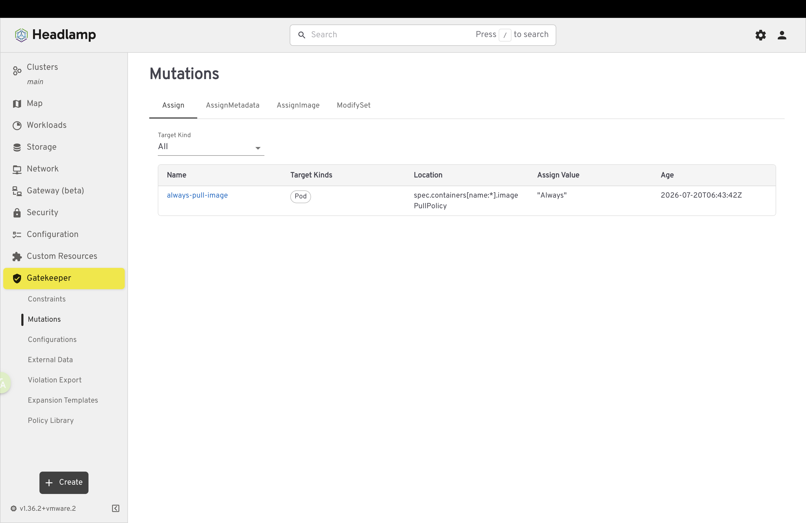
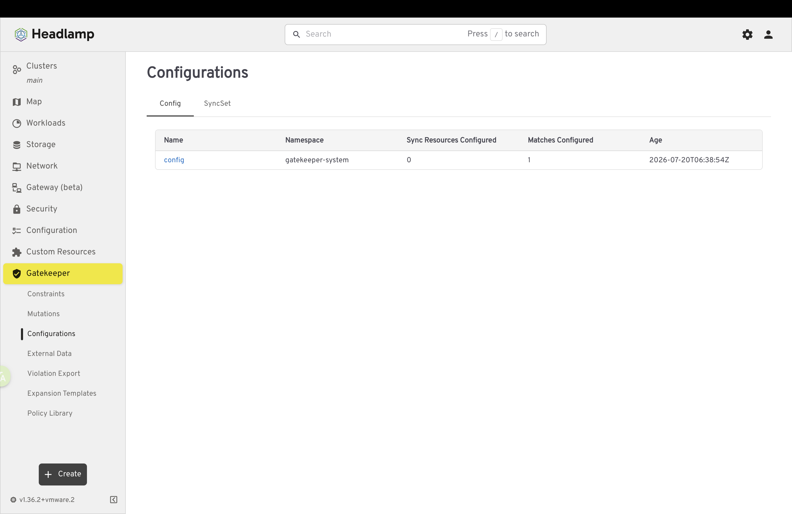
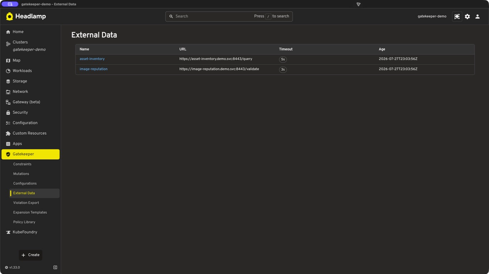
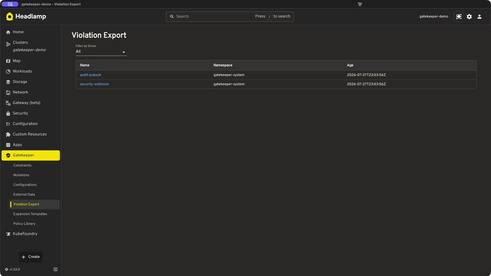
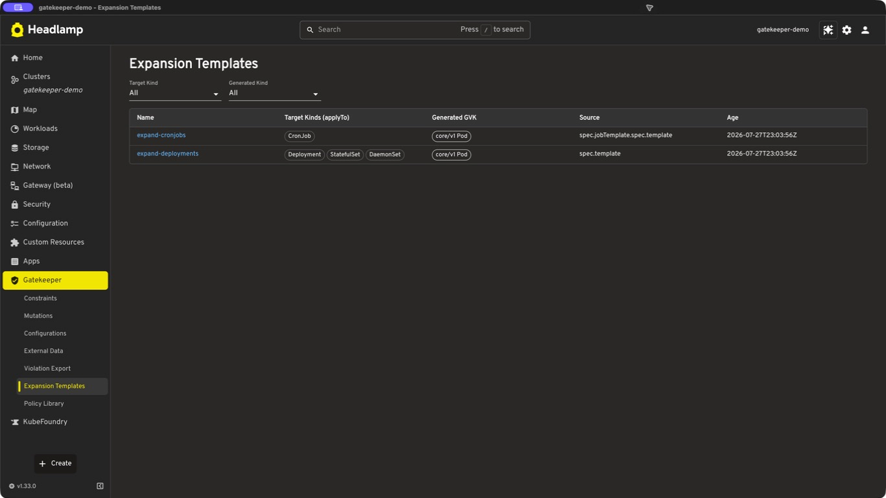
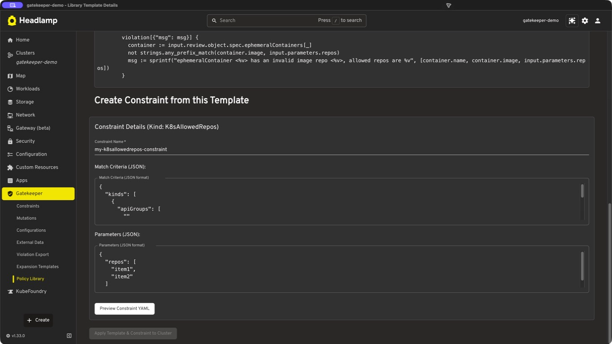

# Gatekeeper Headlamp Plugin

A [Headlamp](https://headlamp.dev) plugin for viewing and managing [OPA Gatekeeper](https://open-policy-agent.github.io/gatekeeper/) policies, mutations, configuration, external data, expansion, violation export resources, and Gatekeeper Policy Library templates in Kubernetes clusters.

## Features

The Gatekeeper sidebar is organized by resource domain: **Constraints**, **Mutations**, **Configurations**, **External Data**, **Violation Export**, **Expansion Templates**, and **Policy Library**. Related resource types share tabbed list pages. Resource details use cluster-aware navigation and, where supported, show controller status and confirmed deletion; error states distinguish missing CRDs, authentication failures, RBAC denial, and Kubernetes API failures.

### Constraints

The **Constraints** page groups policy resources into **Constraint Templates**, **Constraints**, and **Violations** tabs, each with its own route for direct linking.

#### Constraint Templates

- View and browse Gatekeeper ConstraintTemplates in your cluster
- Filter templates by target
- View template details including CRD kind/plural, readiness status, creation time, and targets
- Delete ConstraintTemplates from the UI with a confirmation dialog
- Detect when Gatekeeper CRDs are not installed and show an installation prompt

#### Constraints

- Browse constraints discovered dynamically from installed ConstraintTemplates
- Filter constraints by constraint kind and enforcement action
- View enforcement action, matched resource kinds, total violation count, and creation time
- View constraint details including overview, match rules, audit timestamp, and current violations
- Delete constraints from the UI, using the ConstraintTemplate plural name when available

#### Violations

- Monitor current Gatekeeper audit violations across constraints
- Filter violations by resource kind, constraint kind, enforcement action, and resource name
- View violation messages, affected resources, namespaces, API versions, and related constraints
- View each constraint's current audit timestamp when available

### Mutations

- Browse `Assign`, `AssignMetadata`, `AssignImage`, and `ModifySet` resources in dedicated tabs
- Filter mutations by target resource kind, and filter `ModifySet` resources by operation
- Inspect target kinds, mutation locations, assigned values, image references, and set operations
- Review reconciliation and enforcement status reported in each resource's Gatekeeper status fields, including per-pod observations when available
- Delete mutation resources from their detail pages

### Configurations

- Browse namespaced `Config` resources and cluster-scoped `SyncSet` resources
- Inspect `Config` sync-only resources and match configurations
- Filter `SyncSet` resources by synced kind and view their configured group/version/kind entries
- Review `Config` controller status; `SyncSet` details explicitly note that Gatekeeper does not expose per-resource reconciliation status
- Delete configuration resources from their detail pages

### External Data

- Browse Gatekeeper `Provider` resources
- Inspect provider URLs, timeouts, CA bundles, and controller-reported active status
- Delete providers from their detail pages

### Violation Export

- Browse namespaced `Connection` resources used by Gatekeeper violation export
- Filter connections by driver and inspect driver-specific configuration
- Review controller-reported active status and delete connections from their detail pages

### Expansion Templates

- Browse Gatekeeper `ExpansionTemplate` resources
- Filter by target kind or generated kind
- Inspect the generated group/version/kind and template source paths
- Review controller status and delete expansion templates from their detail pages

### Gatekeeper Policy Library

- Browse templates from the official OPA Gatekeeper Library and filter them by category
- Load only templates with fetched, valid YAML while reporting partial, offline, and GitHub API failures
- Retry GitHub requests with an optional personal access token, which is kept only in plugin memory and can be cleared from the UI
- View raw ConstraintTemplate YAML and customize match criteria and parameters as JSON
- Preview generated Constraint YAML before applying it
- Apply the ConstraintTemplate and generated Constraint after checking existing template compatibility and waiting for the generated CRD to become established

## Screenshots

| Constraints | Constraint Templates |
| --- | --- |
|  |  |
| **Constraint Details** | **Violations** |
|  |  |
| **Mutations** | **Configurations** |
|  |  |
| **External Data** | **Violation Export** |
|  |  |
| **Expansion Templates** | **Policy Library** |
|  |  |
| **Policy Library Deployment** |  |
|  |  |

## Supported Gatekeeper APIs

| Resources | API group and versions |
| --- | --- |
| `ConstraintTemplate` | `templates.gatekeeper.sh/v1`, `templates.gatekeeper.sh/v1beta1` |
| Dynamically discovered constraints | `constraints.gatekeeper.sh/v1beta1` |
| `Assign`, `AssignMetadata`, `AssignImage`, `ModifySet` | `mutations.gatekeeper.sh/v1`, `mutations.gatekeeper.sh/v1beta1`, `mutations.gatekeeper.sh/v1alpha1` |
| `Config` | `config.gatekeeper.sh/v1alpha1` |
| `SyncSet` | `syncset.gatekeeper.sh/v1alpha1` |
| `Provider` | `externaldata.gatekeeper.sh/v1beta1`, `externaldata.gatekeeper.sh/v1alpha1` |
| `Connection` | `connection.gatekeeper.sh/v1alpha1`, `connection.gatekeeper.sh/v1beta1` |
| `ExpansionTemplate` | `expansion.gatekeeper.sh/v1alpha1`, `expansion.gatekeeper.sh/v1beta1` |

## Prerequisites

- [Headlamp](https://headlamp.dev) installed and configured
  - Artifact Hub metadata for this plugin currently declares Headlamp compatibility as `>=0.29`
- A Kubernetes cluster with [Gatekeeper](https://open-policy-agent.github.io/gatekeeper/website/docs/install/) installed
  - If Gatekeeper is not installed, the plugin detects the missing ConstraintTemplate CRDs and provides an installation prompt
  - Mutation, configuration, external data, violation export, and expansion views require the corresponding optional Gatekeeper CRDs to be installed and served by the cluster
- Kubernetes RBAC permissions to list and get the Gatekeeper resources you view, delete resources you remove, and create ConstraintTemplates and Constraints when deploying from the Policy Library
- Network access to GitHub is required to browse the live Gatekeeper Policy Library; an optional personal access token can be supplied for authenticated requests

## Installation

### From Headlamp Plugin Catalog (Recommended)

1. Install and launch [Headlamp](https://headlamp.dev)
2. Open the Plugin Catalog from the Headlamp menu
3. Clear the **Official** filter if it is enabled; this plugin is verified on Artifact Hub but is not marked official
4. Search for "Gatekeeper"
5. Click the install button next to the Gatekeeper plugin
6. Restart Headlamp if required
7. The "Gatekeeper" section will appear in the sidebar

### From Artifact Hub

The plugin is also available on [Artifact Hub](https://artifacthub.io/packages/search?repo=gatekeeper-headlamp-plugin).

### Manual Installation

Download the latest release and extract it to your Headlamp plugins directory.

Common plugin locations:

- **macOS**: `~/Library/Application Support/Headlamp/plugins/gatekeeper-headlamp-plugin/`
- **Linux**: `~/.config/Headlamp/plugins/gatekeeper-headlamp-plugin/`
- **Windows**: `%APPDATA%/Headlamp/Config/plugins/gatekeeper-headlamp-plugin/`

## Contributing

Interested in contributing? See [CONTRIBUTING.md](CONTRIBUTING.md) for development setup, workflows, validation, and project structure.
