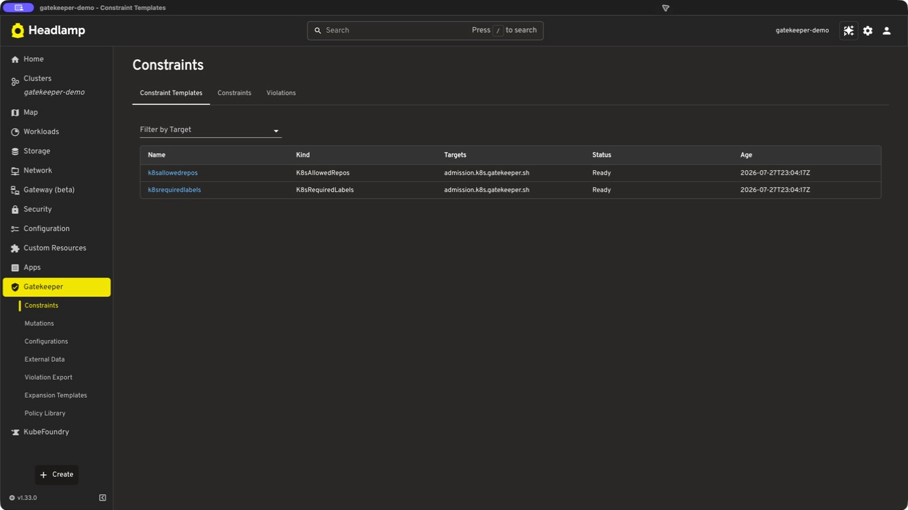
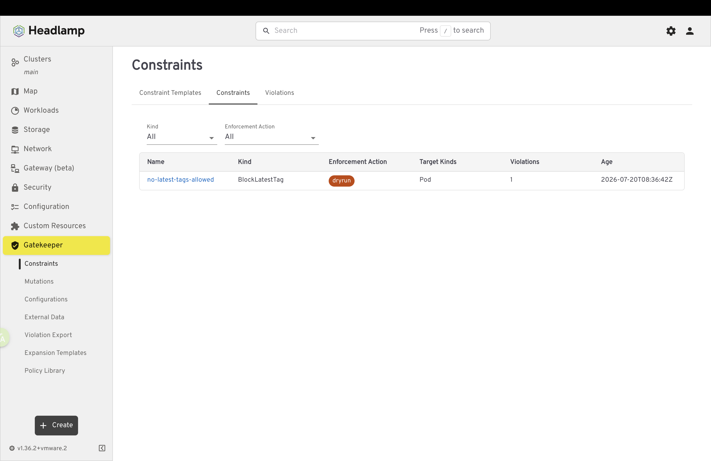
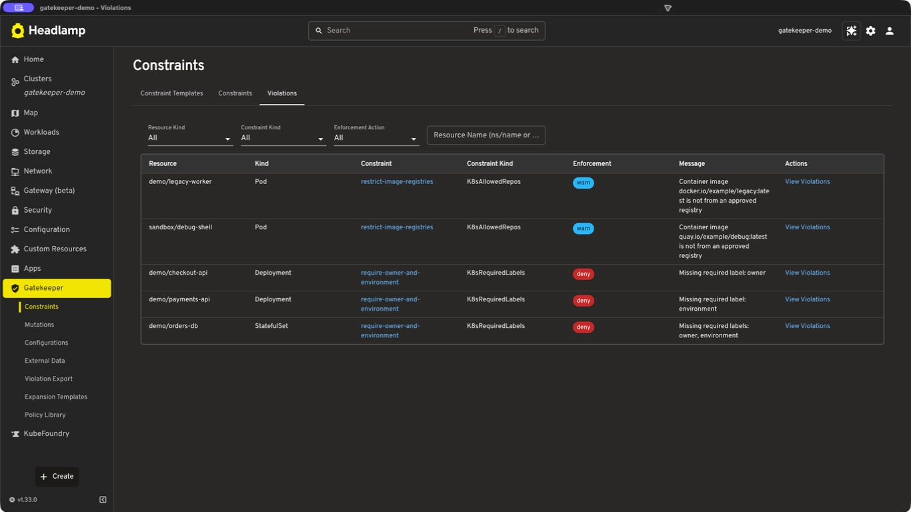
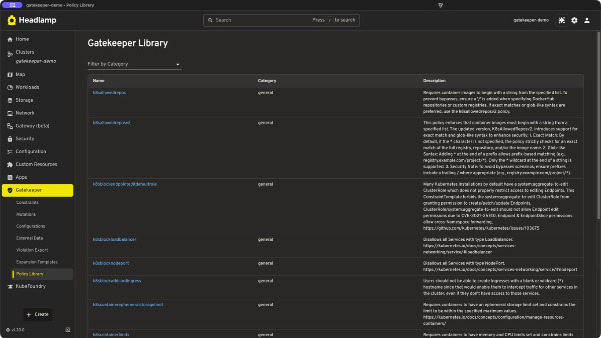
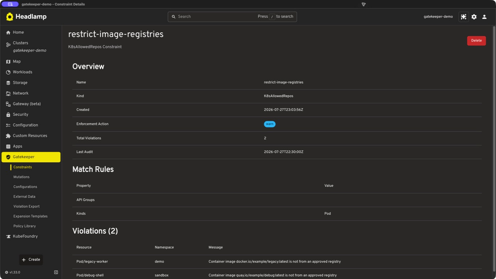

# Gatekeeper Headlamp Plugin

A [Headlamp](https://headlamp.dev) plugin for viewing and managing [OPA Gatekeeper](https://open-policy-agent.github.io/gatekeeper/) policies, violations, and a library of community-sourced templates in Kubernetes clusters.

[](https://artifacthub.io/packages/search?repo=gatekeeper-headlamp-plugin)
[](https://github.com/sozercan/gatekeeper-headlamp-plugin/actions/workflows/test.yml)
[](https://codecov.io/gh/sozercan/gatekeeper-headlamp-plugin)

## Features

- **ConstraintTemplates**: View Gatekeeper constraint templates.



- **Constraints**: Browse constraints with enforcement actions and match rules.



- **Violations**: Monitor policy violations across your cluster.



- **Gatekeeper Library**: Browse, customize, and apply ConstraintTemplates and Constraints from the OPA Gatekeeper Library.



- **Detailed Views**: Comprehensive details for templates and constraints.



## Prerequisites

- Headlamp installed and configured.
- A Kubernetes cluster with [Gatekeeper installed](https://open-policy-agent.github.io/gatekeeper/website/docs/install/).
- For development of the plugin: Node.js and npm (or yarn).

## Installation

- Install [Headlamp](https://headlamp.dev)
- Open Plugin Catalog
- Select the Gatekeeper plugin and click the install button
- After install you may need to restart Headlamp

## Development

This project uses a `Makefile` for common tasks.

1.  **Clone the repository:**
    ```bash
    git clone <repository-url>
    cd gatekeeper-headlamp-plugin
    ```

1.  **Setup & Initial Build:**
    Installs dependencies, builds the plugin, and deploys it to the default Headlamp plugins directory.
    ```bash
    make setup
    ```

1.  **Development Workflow:**
    Builds and deploys the plugin. Use this after making code changes.
    ```bash
    make dev
    ```

1.  **View all Makefile commands and documentation:**
    ```bash
    make help
    ```
    The Makefile is extensively documented with details on build processes, platform support, troubleshooting, and more.

### Loading the Plugin in Headlamp

After running `make deploy` (or `make setup`/`make dev`), the plugin should be available in your Headlamp plugins directory:
- Linux/macOS: `~/.config/Headlamp/plugins/gatekeeper-headlamp-plugin/`
- Windows: `%APPDATA%/Headlamp/plugins/gatekeeper-headlamp-plugin/`

Restart Headlamp if it was running. The "Gatekeeper" section will appear in the sidebar.

## Testing

The project includes comprehensive test coverage with both unit and integration tests.

### Running Tests

**Unit Tests:**
```bash
npm test                    # Run all tests
npm run test:coverage      # Run tests with coverage report
npm run test:watch         # Run tests in watch mode
```

**Integration Tests:**
```bash
# Automated setup and test execution
./scripts/run-integration-tests.sh

# Or manually:
npm run test:integration
```

**Code Quality:**
```bash
make lint           # Run ESLint
make typecheck      # Run TypeScript checks
make format         # Format code with Prettier
```

### Test Structure

- **Unit Tests** (`test/**/*.test.tsx`) - Component and utility tests with mocked dependencies
- **Integration Tests** (`test/integration/`) - Tests against real Kubernetes cluster with Gatekeeper

### Coverage Requirements

The project maintains minimum coverage thresholds:
- Branches: 70%
- Functions: 70%
- Lines: 70%
- Statements: 70%

### CI/CD

All tests run automatically in GitHub Actions on every push and pull request:
1. Linting and type checking
2. Unit tests with coverage reporting
3. Integration tests with kind cluster and Gatekeeper
4. Build validation

See [test/README.md](test/README.md) for detailed testing documentation.
