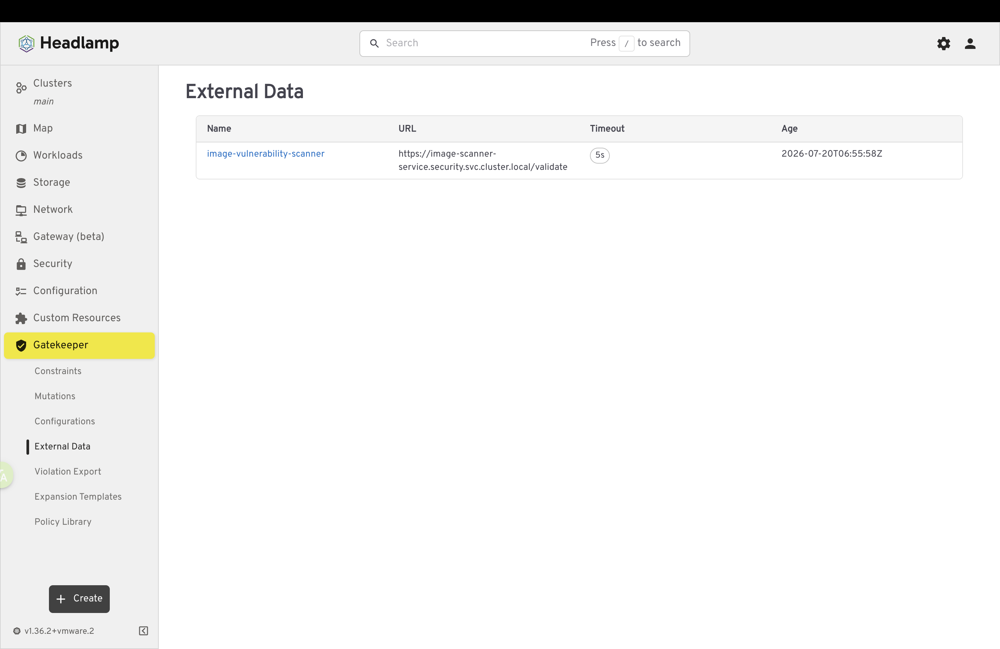
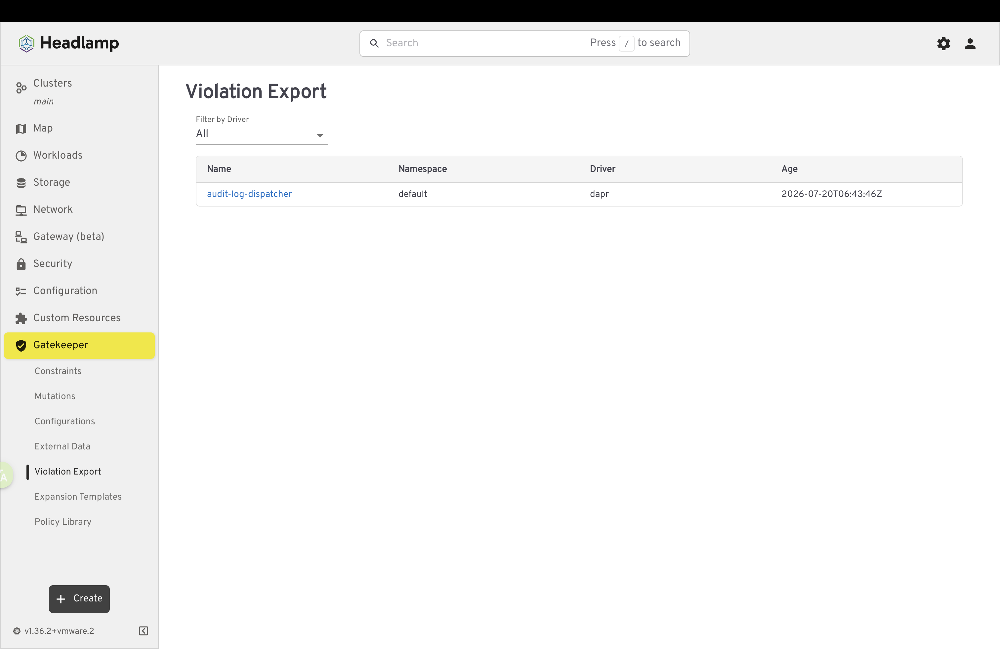
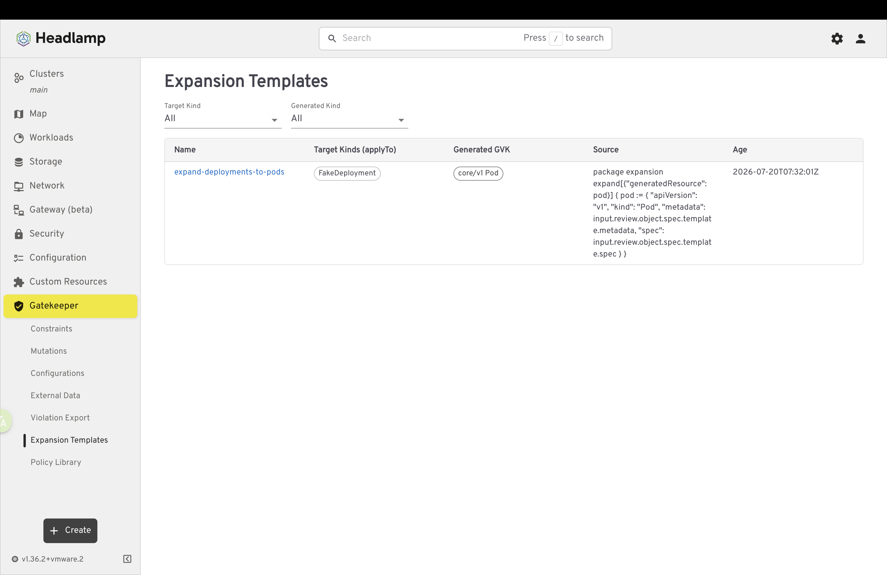
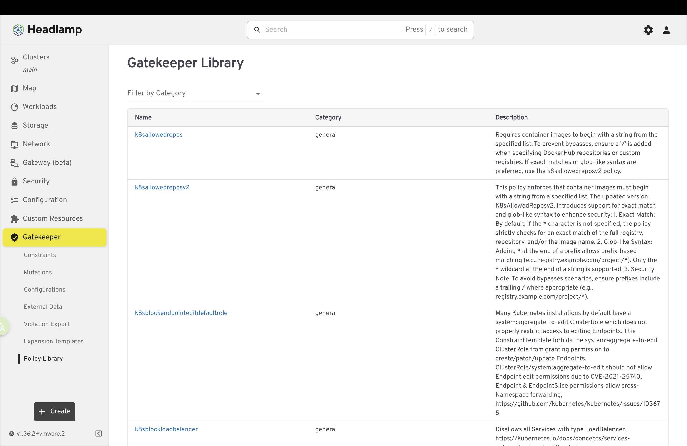

# Gatekeeper Headlamp Plugin

A [Headlamp](https://headlamp.dev) plugin for viewing and managing [OPA Gatekeeper](https://open-policy-agent.github.io/gatekeeper/) policies, mutations, configurations, external data, violations, and Gatekeeper Library templates in Kubernetes clusters.

[](https://artifacthub.io/packages/search?repo=gatekeeper-headlamp-plugin)

## Features

### Constraints
- Manage Gatekeeper constraints and templates (`ConstraintTemplate` and `Constraint`)
- Monitor current Gatekeeper audit violations dynamically discovered from installed resources
- Filter lists by targets, resource kinds, or enforcement actions
- View detailed information including match rules, targets, audit timestamps, and current violation messages
- Detect missing Gatekeeper CRDs gracefully with installation prompts
- Seamlessly delete ConstraintTemplates and Constraints from the UI with a confirmation dialog


### Mutations
- Manage Gatekeeper mutation CRDs including `Assign`, `AssignMetadata`, `AssignImage`, and `ModifySet`
- View mutation details, target kinds, match criteria, and assignment locations/values
- Easily filter mutations by target kinds or domains
- Monitor System Sync Status to ensure mutations are properly enforced
- Seamlessly delete Mutation resources from the UI with a confirmation dialog


### Configurations
- Manage Gatekeeper core configuration CRDs (`Config` and `SyncSet`)
- Monitor synced resources, matched configurations, and overview details
- Check synchronization statuses across your cluster configuration settings
- Seamlessly delete Configuration resources from the UI with a confirmation dialog


### External Data
- Browse and manage External Data `Provider` resources
- View configured URLs, timeout values, and active System Sync Statuses
- Filter Provider components by name and delete them with visual confirmation dialogs



### Violation Export
- Manage External Data `Connection` resources used for Violation Export
- View driver information, namespace, and configuration details for connected external audit systems
- Filter Connections by driver and delete them with visual confirmation dialogs



### Expansion Templates
- Manage `ExpansionTemplate` resources for complex mutation/validation workflows
- View the generated GVK (GroupVersionKind) and template source definitions
- Filter Expansion Templates by generated GVK and delete template assets effectively



### Gatekeeper Library
- Browse templates from the official OPA Gatekeeper Library by category
- View template names, descriptions, and raw ConstraintTemplate YAML
- Customize match criteria and parameters as JSON
- Generate Constraint YAML and apply the ConstraintTemplate plus generated Constraint to your cluster
- **Authentication Support:** Add your GitHub Personal Access Token (PAT) directly in the UI to prevent unauthenticated API rate-limit errors and ensure reliable loading. Token logic handles offline/air-gapped environments gracefully.



## Prerequisites

- [Headlamp](https://headlamp.dev) installed and configured
  - Artifact Hub metadata for this plugin currently declares Headlamp compatibility as `>=0.29`
- A Kubernetes cluster with [Gatekeeper](https://open-policy-agent.github.io/gatekeeper/website/docs/install/) installed
  - If Gatekeeper is not installed, the plugin detects the missing CRDs and provides an installation prompt
- For plugin development: Node.js v18.0.0 (LTS) or later and npm v10.0.0 or later are recommended

## Installation

### From Headlamp Plugin Catalog (Recommended)

1. Install and launch [Headlamp](https://headlamp.dev)
2. Open the Plugin Catalog from the Headlamp menu
3. Search for "Gatekeeper"
4. Click the install button next to the Gatekeeper plugin
5. Restart Headlamp if required
6. The "Gatekeeper" section will appear in the sidebar

### From Artifact Hub

The plugin is also available on [Artifact Hub](https://artifacthub.io/packages/search?repo=gatekeeper-headlamp-plugin).

### Manual Installation

Download the latest release and extract it to your Headlamp plugins directory.

Common plugin locations:

- **Linux/macOS**: `~/.config/Headlamp/plugins/gatekeeper-headlamp-plugin/`
- **Windows**: `%APPDATA%/Headlamp/Config/plugins/gatekeeper-headlamp-plugin/`

> The Makefile is currently configured to deploy to `~/Library/Application Support/Headlamp/plugins`. If your Headlamp installation uses another plugins directory, update `HEADLAMP_PLUGINS_DIR` in `Makefile` before running `make deploy`, `make dev`, or `make setup`.

## Development

This project uses a `Makefile` for common development workflows.

### Quick Start

1. **Clone the repository:**

   ```bash
   git clone https://github.com/sozercan/gatekeeper-headlamp-plugin.git
   cd gatekeeper-headlamp-plugin
   ```

2. **First-time setup:**

   Installs dependencies, builds the plugin, and deploys it to the configured Headlamp plugins directory:

   ```bash
   make setup
   ```

3. **Development workflow:**

   After making code changes, rebuild and deploy:

   ```bash
   make dev
   ```

4. **Run checks:**

   ```bash
   npm test
   npm run lint
   npm run tsc
   npm run format
   ```

### Available npm Scripts

- `npm run build` - Build the plugin
- `npm run start` - Start the Headlamp plugin development server
- `npm run package` - Package the plugin for distribution
- `npm test` - Run the Headlamp plugin test runner
- `npm run lint` - Check code style
- `npm run lint-fix` - Fix code style issues
- `npm run format` - Format code with Prettier
- `npm run tsc` - Run the TypeScript compiler
- `npm run extract` - Extract the built plugin into `.plugins/`

### Makefile Commands

View all available Makefile commands and documentation:

```bash
make help
```

Common commands:

- `make setup` - First-time setup (`install` + `build` + `deploy`)
- `make dev` - Development workflow (`build` + `deploy`)
- `make build` - Build and extract the plugin
- `make deploy` - Deploy `.plugins/` to the configured Headlamp plugins directory
- `make clean` - Clean build artifacts
- `make validate` - Clean, build, and validate expected output files

### Project Structure

```text
gatekeeper-headlamp-plugin/
├── src/
│   ├── constraint/          # Constraint list and detail views
│   ├── constraint-template/ # ConstraintTemplate list and detail views
│   ├── violations/          # Violation list and detail views
│   ├── mutation/            # Mutation (Assign, AssignImage, ModifySet) views
│   ├── configuration/       # Gatekeeper Config and SyncSet views
│   ├── externaldata/        # Provider and Connection (Violation Export) views
│   ├── expansion/           # ExpansionTemplate views
│   ├── library/             # Gatekeeper Library integration
│   ├── types/               # TypeScript type definitions
│   ├── model.ts             # API Models for CRDs and dynamic constraint discovery
│   └── index.tsx            # Plugin routes and sidebar entries
├── images/                  # README and Artifact Hub screenshots
├── dist/                    # Build output (temporary)
├── .plugins/                # Extracted plugin package (deployment-ready)
├── artifacthub-pkg.yml      # Artifact Hub package metadata
├── artifacthub-repo.yml     # Artifact Hub repository metadata
└── Makefile                 # Build and deployment automation
```

## Contributing

Contributions are welcome! Please feel free to submit a pull request.

## License

Apache-2.0 License - see [LICENSE](LICENSE) for details.
